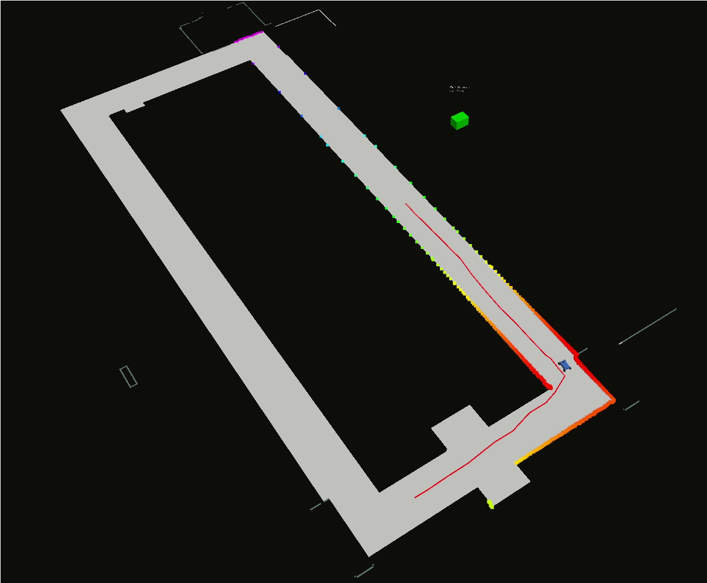

# mpc_av

This repository runs model predictive controller for trajectory generation and tracking of Autonomus Vehicles. Note: This repository uses cvxgen to solve mpc optimization equations which requires a license (/acadmeic license)



How to use:


- Go To catkin_ws: 
```
cd catkin_ws/src
```
- Clone the current Repository: 
```
git clone https://github.com/YashTrikannad/mpc_av.git
```
- Clone the Repository for the F110 Simulator:
```
git clone https://github.com/mlab-upenn/racecar_simulator.git
cd ..
catkin_make
```
- Run the simulator:
```
roslaunch racecar_simulator simulator.launch
```
- Run the mpc controller
```
roslaunch mpc_av mpc_av.launch
```
- Press *n* to start the car 

